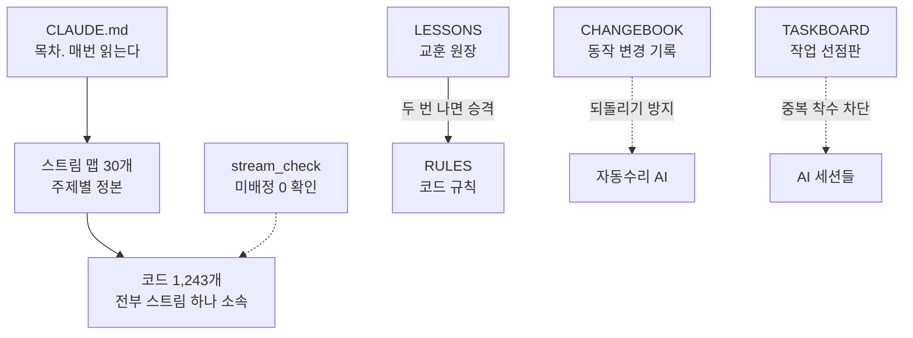

# stream-harness

[English](README.md) | **한국어**

개발자가 아닌 직장인 한 명이 AI 에이전트 여러 개에게 일과 생활 30갈래를 맡기면서 다듬은 운영 방식입니다.
코드는 AI가 씁니다. 저는 무엇을 맡길지 정하고, 결과를 확인하고, 규칙을 고칩니다.

제 실제 폴더는 공개하지 않습니다. 개인 자료와 계정 정보가 섞여 있어서요. 여기에는 뼈대만 떼어 놓았습니다.

## 막혔던 건 코드가 아니었습니다

AI에게 일을 많이 맡기자 코드 품질보다 이런 일이 먼저 터졌습니다.

- 지난주에 만든 걸 모르고 또 만든다.
- 사람이 고쳐 놓은 걸 자동수리 AI가 원래대로 되돌린다.
- 규칙을 고쳤는데 다른 문서에 남은 옛 사본이 계속 일을 시킨다.
- 대화창 여러 개가 같은 일을 동시에 한다.

모델을 바꾼다고 풀리는 문제가 아니었습니다. AI가 일하는 환경을 설계해야 했죠. 요즘은 이걸 하네스 엔지니어링(harness engineering)이라고 부릅니다. 말(모델)이 아니라 마구(하네스)를 손본다는 뜻입니다.

## 구조



AI는 `CLAUDE.md`만 매번 읽습니다. 회의록 얘기가 나오면 회의록 맵을, 블로그 얘기가 나오면 발행 맵을 그때 펼칩니다. 처음부터 전부 읽히면 문맥이 넘쳐서 오히려 멍청해집니다.

스트림은 일의 한 갈래입니다. 갈래마다 맵 문서가 하나씩 있고, 거기에 무엇이 있는지, 파일이 어디 있는지, 배포는 어떻게 하는지, 어디서 넘어졌는지, 최근에 뭘 바꿨는지가 적혀 있습니다.

## 계약서에 빗대면

저는 조선소에서 해양플랜트 계약 관리와 해외 영업을 오래 했습니다. 이 구조를 계약서에 대 보면 이렇습니다.

| 계약서 | 여기서 |
|---|---|
| 총칙·정의 | `CLAUDE.md` |
| 업무 범위(SOW) | 스트림 맵 |
| 특약 | `RULES.md` |
| 조항 충돌 시 우선순위 | 돈과 외부 발행 안전 > 정직한 실패 보고 > 임무 완수 > 효율 |
| 클레임 기록 | `LESSONS.md` |
| 변경 지시서(Change Order) | `CHANGEBOOK.md` |

사람끼리 일할 때 계약서가 필요한 이유와 같습니다. 무엇을 누가 하고, 부딪히면 뭐가 이기고, 바뀐 건 어디에 남는지.

## 규칙 다섯 개, 그리고 그 규칙을 만든 사고

규칙은 전부 사고에서 나왔습니다. 미리 상상해서 만든 건 대부분 지켜지지 않았고요.

**1. 내용은 정본 한 곳에만.** 2026-09-07 지침 문서를 전수조사하니 낡은 규칙이 8건 나왔는데, 8건 모두 복사본이었습니다. 정본은 고쳤고 사본은 아무도 안 봤던 거죠. 그 뒤로 목차 문서에는 이름과 위치만 적습니다.

**2. 30분 넘는 일은 선점판에 먼저.** 2026-08-16 AI 세션 여러 개가 서로 모른 채 같은 영상 샘플을 만들어, 결과물이 네 벌 나왔습니다.

**3. 동작이 바뀌면 한 줄 남긴다.** 자동수리 AI가 사람이 고친 걸 되돌리지 않게 하려고 만든 기록입니다. 그런데 2026-09-14에 점검해 보니 구멍이 둘 있었습니다. 파일 이름을 뭉뚱그려 적은 줄 때문에 55개 넘는 파일이 방어 밖이었고, 기록을 읽는 코드가 다섯 벌로 복사돼 서로 다르게 읽고 있었습니다. 적는 형식을 못 박고, 읽는 코드는 하나로 합쳤습니다.

**4. 지금 상태를 프롬프트에 박아 두지 않는다.** "우리가 가진 도구는 이것" 같은 문장을 프롬프트에 적어 뒀다가, 그게 낡아서 파일 5개가 한꺼번에 잘못 판단했습니다(2026-08-18). 지금은 실행할 때 정본에서 읽어 넣습니다.

**5. 검사기 없는 규칙은 또 건너뛴다.** 교훈 원장을 쌓아 보니 같은 실수가 규칙이 있는데도 반복됐습니다. 사람이 읽고 지키는 규칙은 바쁘면 건너뜁니다. AI도 똑같았습니다. 그래서 규칙을 새로 세울 때마다 기계로 잡을 수 있는지부터 보고, 안 되면 안 된다고 규칙에 적어 둡니다.

## 숫자로 보면 (2026년 9월)

- 코드 1,243개, 스트림 30개, 담당 없는 코드 0개
- 교훈 원장 130건 (7월 22일 개설)
- 동작 변경 기록 1,694줄 (8월 8일부터 7주)
- 결론이 나오면 다른 AI에게 그 결론을 깨 보라고 시킵니다. 한 AI의 자체 확인은 자기가 놓친 걸 그대로 통과시키더군요.

## 오픈AI가 말한 하네스 엔지니어링과 비교

오픈AI가 2026년 2월 공개한 [Harness engineering](https://openai.com/index/harness-engineering/)과 뼈대가 같습니다. 짧은 목차 문서, 주제별 정본, 필요할 때만 펼쳐 읽기, 기계로 강제하기.

다른 점은 세 가지입니다.

- 개발팀의 제품 저장소가 아니라 한 사람의 업무와 생활 전체에 적용했습니다.
- 코드 소유권을 파일 단위로 셉니다. 담당 없는 코드가 하나라도 있으면 점검기가 빨간불을 켭니다.
- 규칙을 세우는 규칙이 따로 있습니다. 규칙이 늘수록 규칙끼리 낡고 부딪히는 게 가장 큰 문제였거든요.

## 써 보려면

| 파일 | 용도 |
|---|---|
| `templates/ko/CLAUDE.md` | 최상위 지침 견본. 목차, 라우팅, 충돌 순서, 권한 경계 |
| `templates/ko/docs/streams/stream_TEMPLATE.md` | 스트림 맵 틀 |
| `templates/ko/LESSONS.md` | 교훈 원장 틀과 예시 |
| `templates/streams.json` | 스트림 배정표 예시 |
| `tools/stream_check.py` | 모든 코드가 스트림 하나에 배정됐는지 점검 |
| `tools/leak_check.py` | 공개 저장소 유출 차단기. 이 저장소도 이걸 통과해야 올라갑니다 |

```
python tools/stream_check.py templates/streams.json --root <내 폴더>
python tools/leak_check.py --staged --deny <저장소 밖 금지어.json> --vault <저장소 밖 비밀 폴더>
```

`leak_check`는 API 키 형식과 전화번호 같은 흔한 패턴 말고도, 비밀값이 든 폴더의 값을 전부 읽어 그 값이 그대로 섞이면 막습니다. 커밋 메시지, 작성자 이메일, 올라갈 커밋 이력까지 봅니다. 금지어 목록과 비밀 폴더는 저장소 밖에 둡니다. 목록 자체가 새면 안 되니까요.

영문 템플릿은 `templates/en/`에 있습니다.

## 만든 사람

mcpmcp. 에너지 회사에서 해외 발전 사업을 검토하고 있습니다. 그 전에는 해양플랜트 계약 관리와 해외 영업, 합작사 협상을 했습니다. 사람과 계약서를 상대하던 방식 그대로 AI에게 일을 맡기고 있습니다.

LinkedIn: https://www.linkedin.com/in/mcjeffpark

MIT License.
