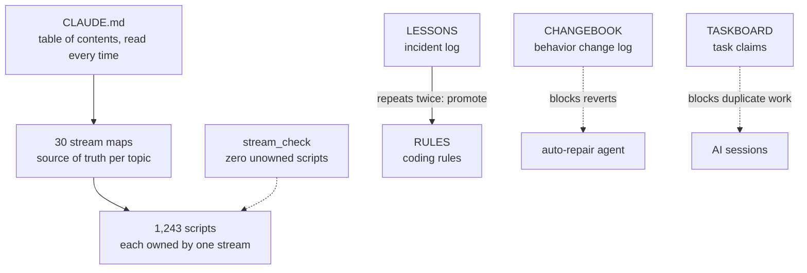

# stream-harness

**English** | [한국어](README.ko.md)

How one non-developer runs a team of AI coding agents across 30 areas of work and life.
The AI writes the code. I decide what to hand off, check what comes back, and fix the rules.

My real workspace stays private because it is full of personal data and account details. This repo is the skeleton, rebuilt by hand.

## The code was never the hard part

Once I handed a lot of work to AI, the code itself was rarely what broke. These did:

- It built something again because it didn't know it had built the same thing last week.
- An auto-repair agent undid a fix a person had just made, and the bug came back.
- I updated a rule, but an old copy in another document kept giving orders.
- Several chat sessions picked up the same job at the same time.

A better model fixes none of these. The environment the AI works in has to be designed. People now call this harness engineering. You leave the horse alone and fix the harness.

## Structure



The agent reads `CLAUDE.md` every time and nothing else up front. When the topic is meeting notes, it opens the meeting-notes map. When it is the blog, it opens the publishing map. Feed it everything at once and the context overflows. It gets dumber, not smarter.

A stream is one area of work. Each has a single map document: what exists, where the files live, how to deploy, where things went wrong before, and what changed recently.

## Read it like a contract

I spent years at a shipyard in offshore plant contract management. Map this setup onto a contract and you get:

| Contract | Here |
|---|---|
| General Conditions and Definitions | `CLAUDE.md` |
| Scope of Work | stream maps |
| Special Conditions | `RULES.md` |
| Order of Precedence | money and publishing safety > honest failure reports > finishing the job > efficiency |
| Claims log | `LESSONS.md` |
| Change Orders | `CHANGEBOOK.md` |

People who work together need a contract for the same reasons. Who does what, which clause wins when two collide, and where changes get written down.

## Five rules and the incidents behind them

Every rule came out of something going wrong. The ones I wrote in advance, just in case, mostly got ignored.

**1. Keep content in one place.** On 2026-09-07 I audited my instruction documents and found 8 outdated rules. All 8 were copies. The original had been updated and nobody looked at the copies. Since then the index document holds only names and locations.

**2. Claim anything over 30 minutes on the task board first.** On 2026-08-16 several AI sessions, unaware of each other, built the same video sample. I ended up with four of them.

**3. Log every behavior change in one line.** The log exists so the auto-repair agent doesn't undo fixes people made. On 2026-09-14 a check found two holes. Lines that named files loosely left more than 55 files outside that protection, and the code reading the log had been copied five times, each copy reading it a little differently. I pinned down the format and merged the readers into one.

**4. Don't hard-code the current state into prompts.** I once wrote "here are the tools we have" into prompts. The list went stale and five files made the wrong call at once (2026-08-18). Now the list is read from the source document at run time.

**5. A rule without a checker gets skipped.** The incident log showed the same mistakes repeating while a rule against them already existed. People skip written rules when they are busy. So did the AI. Every new rule now starts with one question: can a machine catch this? If not, the rule says so.

## By the numbers (September 2026)

- 1,243 scripts, 30 streams, 0 scripts without an owner
- 130 entries in the incident log (started July 22)
- 1,694 lines in the change log (seven weeks since August 8)
- When an agent reaches a conclusion, a different AI is told to break it. An agent checking its own work lets through exactly what it missed the first time.

## Compared with OpenAI's harness engineering

The skeleton matches what OpenAI described in [Harness engineering](https://openai.com/index/harness-engineering/) (February 2026): a short table-of-contents file, per-topic sources of truth, documents opened only when needed, and enforcement by tools instead of good intentions.

Three differences:

- It covers one person's whole working and personal life, not a dev team's product repo.
- Ownership is counted per file. If a single script has no stream, the checker fails.
- There are rules for writing rules. As the rulebook grew, the biggest problem was rules going stale or contradicting each other.

## Try it

| File | What it is |
|---|---|
| `templates/en/CLAUDE.md` | Top-level instruction file: index, routing, order of precedence, what to ask vs. decide |
| `templates/en/docs/streams/stream_TEMPLATE.md` | Stream map template |
| `templates/en/LESSONS.md` | Incident log format with examples |
| `templates/streams.json` | Example stream assignments |
| `tools/stream_check.py` | Checks that every script belongs to exactly one stream |
| `tools/leak_check.py` | Leak blocker for public repos. This repo has to pass it before anything goes up |

```
python tools/stream_check.py templates/streams.json --root <your folder>
python tools/leak_check.py --staged --deny <blocklist.json outside the repo> --vault <secrets folder outside the repo>
```

`leak_check` catches the usual patterns such as API keys and phone numbers. It also reads every value in your secrets folder and blocks the commit if one of them shows up as is. Commit messages, author emails and the whole history about to be pushed get checked too. Keep the blocklist and the secrets folder outside the repo, since the list itself is sensitive. The tools print their messages in Korean for now.

Korean versions of the templates are in `templates/ko/`.

## About me

mcpmcp. I review overseas power generation projects at an energy company. Before that I worked on offshore plant contracts, international sales and joint-venture negotiations. I hand work to AI the way I used to deal with people and contracts.

LinkedIn: https://www.linkedin.com/in/mcjeffpark

MIT License.
